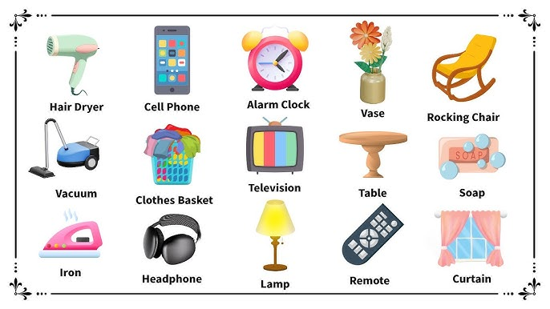
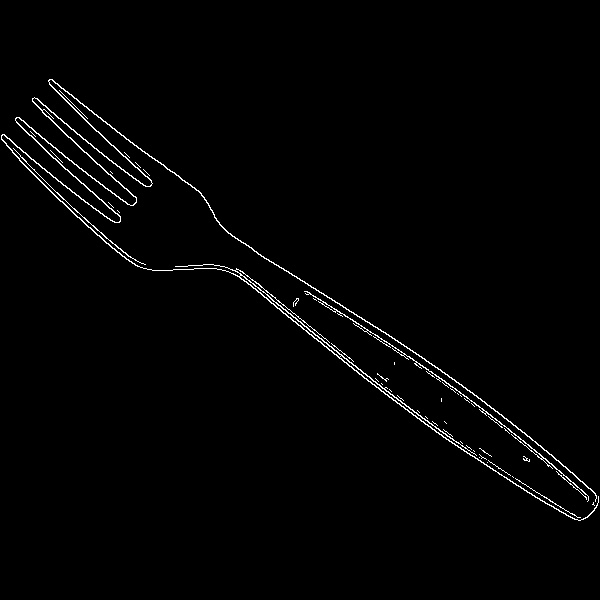
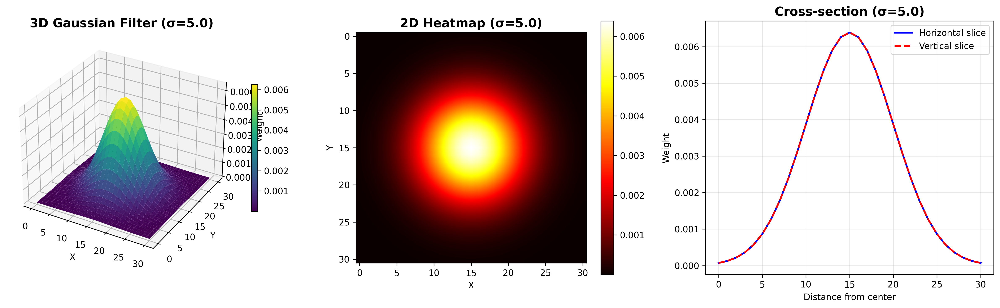
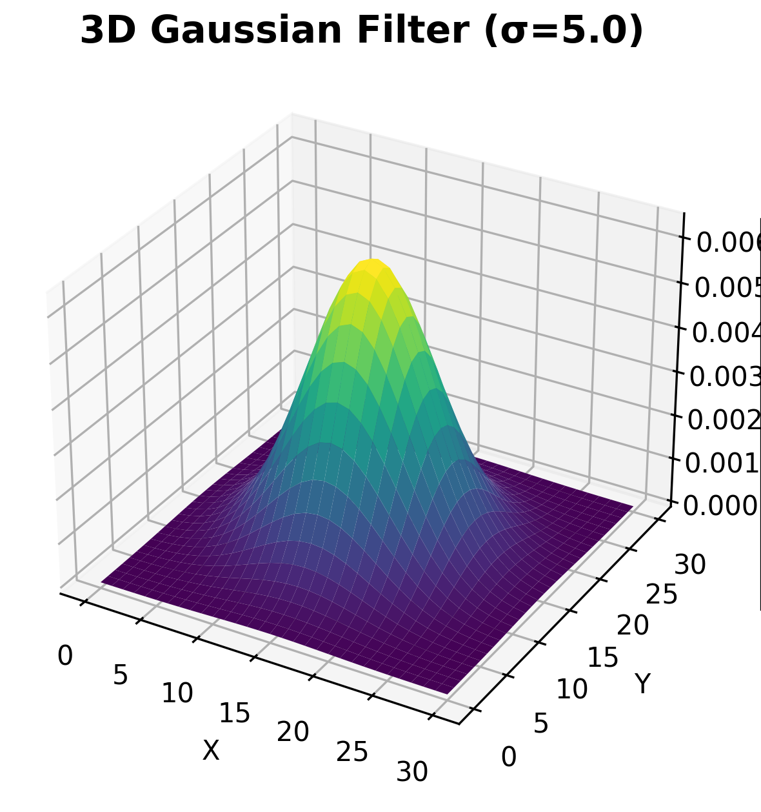
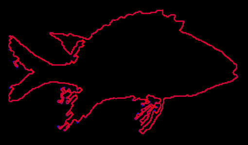
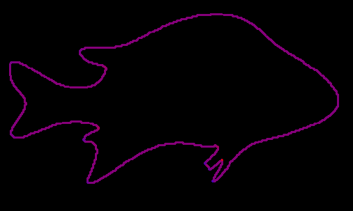
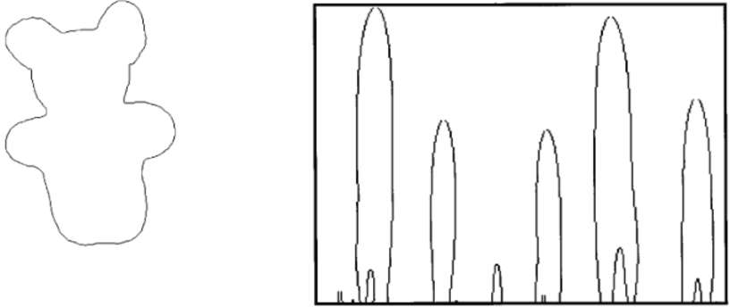
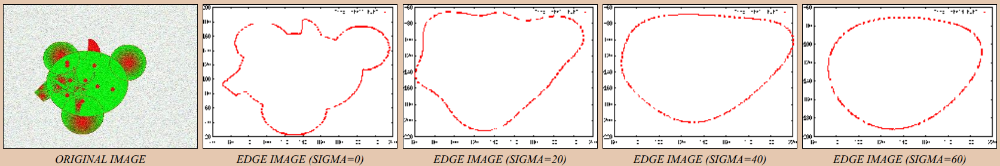

# Four Vertex Theorem

and its applications in object recognition.

Interactive slide (recommended): https://second-last.github.io/math1060-fvt

---
hide: true
---

# Volunteers?

We would like two volunteers to come up and we'll take a photo of
them.

The remaining presentation will show how the Four Vertex Theorem
helps us differentiate between an image of Gavin versus an image of
someone else purely based on boundaries.

---
hide: true
src: ./pages/intro.md
---

---
layout: two-cols-header
layoutClass: gap-x-4
---

# Motivation

Given an input image and knowledge of many object images...

= 2"
  :class="$clicks >= 3 ? 'scaled-moved-db' : 'centered-large-db'"
  class="image-transition-db"
>
  

**...how do we recognize what the input image is?**

What's is this object?

= 5"
  :class="$clicks >= 6 ? 'scaled-moved' : 'centered-large'"
  class="image-transition"
>
  

<!--
#It's a fork, yes. We know that because we have human brain. But as computer, where do we look at to understand, and recognize it's a fork?
-->

**One natural approach:** As we study differential geometry, let's look at **curves**!

**A natural curve to examine:** The object's **boundary**

= 9"
  :class="$clicks >= 10 ? 'scaled-moved2' : 'centered-large2'"
  class="image-transition2"
  v-click="[9,10]"
>
  

Nice! But, what now?

---

# Collecting Our Intuition

Looking at the fork boundary, how do we identify distinctive features?

In our minds, we naturally focus on:

- **Pointy** prongs → high curvature with local extrema
- **Rounded** curves → moderate curvature values
- **Straight** edges → curvature near zero

All of these observations relate to **curvature**!

More precisely:
- Pointy features → curvature has **local extrema**
- Rounded features → curvature is relatively **small**
- Straight features → curvature is **≈ 0**

**Key insight:** Local extrema and zero-crossings of curvature serve as reliable **signatures** for identifying object boundaries.

---

# Challenge #1: Invariance to Transformations

Using curvature features is promising, but we need them to be **robust** to common image transformations.

**The problem:** If we store curvature extrema as $(x, y, \kappa)$ coordinates:
- Rotating the fork → all $(x, y)$ coordinates change
- Translating the fork → all $(x, y)$ coordinates change
- The **same object** would have **different signatures**!

**The solution:** Make our representation **invariant** to rigid motions:

1. **Parameterize by arc length** $s$ instead of $(x, y)$ coordinates
2. **Normalize the domain** to $[0, 1]$ (scale-invariant)

Now the same fork always has the same signature, regardless of position, rotation, or scale!

---

# Challenge #2: Distinguishing Convex from Concave

For object recognition, we need to tell apart curves that bend **inward** vs **outward**.

**The problem:** Standard curvature $\kappa(u) = |c''(u)|$ we learnt in class is always **positive** — it only tells us *how much* a curve bends, not *which direction*.

**The solution:** Use **signed curvature** to capture the direction of bending.

Starting with the general curvature formula for plane curves $c(u) = (x(u), y(u))$:

$$
\kappa = \frac{|c'(u) \times c''(u)|}{|c'(u)|^3}
= \frac{|x'(u) y''(u) - y'(u) x''(u)|}{(x'(u)^2 + y'(u)^2)^{3/2}}
$$

**Remove the absolute value** in the numerator to get signed curvature:

$$
\kappa_{\text{signed}}(u) 
= \frac{x'(u) y''(u) - y'(u) x''(u)}{(x'(u)^2 + y'(u)^2)^{3/2}}
$$

Now: **positive** = bending left (convex), **negative** = bending right (concave).

---

# Challenge #3: Dealing with Noise and Multiple Scales

This isn't the perfect world of MA1060 anymore :( Noise is everywhere!

Say you're taking a picture with a crappy camera, and your hand is shaking a lot. You might get a pretty unsatisfying input picture. What do we do to de-noise it?

One classic approach in Computer Vision is to apply a smoothing filter. **Gaussian filter** is a popular choice.

$$g_\sigma(x, y) = \frac{1}{2\pi\sigma^2}e^{-(x^2+y^2)/(2\sigma^2)}$$ 

where $\sigma$ is the standard deviation.

---

# Gaussian Smoothing: Multi-Scale View

**Key insight:** As $\sigma$ increases, the curve becomes smoother:
- Small noise → eliminated at low $\sigma$
- Fine details → disappear at moderate $\sigma$  
- Essential shape → persists until high $\sigma$

**What smoothing an image looks like:**

  
  

    
    
→

  

  

---

# Applying Smoothing to Curves

Let's do some MA1060!

For smoothing a curve, we can think of it as **evolving the curve** through a family of increasingly "regular" versions:

$$\gamma_\sigma(u) = \gamma(u) \otimes g_\sigma(u)$$

**What smoothing a curve looks like:**

  
  

    
    
→

  

  

---

# Curvature Scale Space (CSS)

For some reason, everyone uses zero-crossings.

Formally, a CSS representation of a space curve is the set of points $(u,
\sigma)$ where $\kappa_\sigma(u) = 0$ holds, where $\kappa_\sigma$ is the signed
curvature of the curve after being gaussian-smoothed with parameter $\sigma$.

TODO: show image

---

# Claim: CSS Is A Signature of A Curve

w.r.t to ___

Recall the Fundamental Theorem of Curves: every regular curve with non-zero
curvature has its shape completely determined by its curvature.

CSS to Computer Vision is what FTC is to Differential Geometry.

---

# "Proof"

...since our claim is not a really a provable theorem anyway.

In terms of computer vision,
in terms of object recognition, there are several scenarios we
want our signature to be resiliant to:

- Rigid motion
- Scaling
- Noise

TODO: put examples of the same fish, but rotated, scaled, and slightly
noise-ified (maybe blurred)?

---

# Returning to the Initial Question

How do we recognize an object from a bank in a sea of contours?

TODO: Show actual object recognition example.

---
hide: true
---

# Challenge

<v-clicks>

Too many vertices!

Plus, a lot of them aren't actually meaningful. Even a tiny sharp
corner is counted as a vertex.

{width=200px}

Goal for simplification:
reduce the number of vertices while preserving the essential
shape.

</v-clicks>

---
hide: true
---

# Key Question

What's the minimum structural complexity of a boundary?

Or: how many vertices can we throw away until we can't reliably
recognize anything?

---
hide: true
---

# Four Vertex Theorem

The answer was revealed at the start...

<v-clicks>

## Terminology

- **Boundary:** a simple, closed, smooth plane curve $\alpha(t)$.

- **Vertex:** A certain $t$ where $\kappa'(t) = 0$

## Statement

A simple, closed, smooth plane curve has at least four local extrema:

- At least two local maxima.
- At least two local minima.

(assumes non-constant curvature, i.e. no circles)

</v-clicks>

---
hide: true
---

# Intuition on the 4

Start with the simplest curve: a circle. To make the curve more
complex, let's turn it into an ellipse.

<CircleToEllipse :width="500" :height="300" />

<v-clicks>

- Red and 
  green are the maxima and minima points.
- Every non-circular closed curve must have at least 4 such extrema!
- Any thing more complex will have more vertices.

</v-clicks>

---
hide: true
---

# Proof Idea

<!-- "The essence of the proof may be distilled in a single phrase: -->
<!-- consider the circumscribed circle." - Robert Osserman, 1985 -->

* For the sake of contradiction, assume curve $\alpha$ has only **two vertices**, $p$ and $q$ (a maximum and a minimum for the curvature $k(s)$).
    * The curve is split into two arcs, $\beta$ and $\gamma$, by the points $p$ and $q$.
* A straight line $L$ is drawn through the two assumed vertices, $p$ and $q$.
    * The convexity of the curve implies that each of the arcs ($\beta$ and $\gamma$) must lie on a **definite side** of the line $L$.
* Contradiction: A specific integral (Eq. 5 in the text) involving $k'(s)$ is used to show that if $\alpha$ has only two vertices, $k'(s)$ must change sign twice on at least one of the arcs ($\beta$ or $\gamma$).
    * Two sign changes for $k'(s)$ on an arc, between the maximum and minimum, means there must be **two additional zeros** for $k'(s)$ on that arc.
    * This forces the existence of a **third and a fourth vertex**, contradicting the initial assumption of only two. 

TODO: draw a diagram that shows such $\beta$, $\gamma$, and $L$.

---
hide: true
---

# What the 4 doing?

Real object has way more than four vertices!

{width=200px}

Now we know that the minimum we need is four vertices, we need a
systematic way to reduce many vertices down to four.

---
hide: true
---

# Curvature Scale Space (CSS)

CSS Representation: multi-scale organization of the invariant
geometric features (either curvature extremas or zero-crossing
points).

The CSS graph is (implicityly) defined by $\kappa(\sigma, u) = 0$,
y-axis $\sigma$ as smoothing level, x-axis $u$ as arc length.

---
hide: true
---

# The Full Object Comparison Algorithm

1. Extract contour (i.e. boundary).
2. Compute the CSS graph shown below by smoothing the curve until there are four extremas
   left.
3. Use some algorithm to compare the four extremas. There are many
   creative algorithms you can choose that we won't elaborate on here.

TODO: explain the CSS graph a bit more, since this example in the
paper uses
zero-crossing points and not extremas. Maybe we should create our own
graph.

{width=500px}

---
hide: true
---

# CSS Demo

High level: keep smoothing until you have four vertices left!

\<show, best case sliders with smoothing parameters, worst case GIFs,
of the smoothing of the boundaries of different objects with all
vertices shown on the curves, so students can see in realtime how
smoothing removes extremas>

---
hide: true
---

# How FVT helps CSS

FVT guarantees the fundamental structure that we'll eventually
approach 4 extremas before becoming circular.

---
hide: true
---

# To Sum Up

- The Four Vertex Theorem tells us that shapes fundamentally have at
  least 4 curvature extrema.

- This is an intrinsic property of the shape.

- While FVT itself isn't used in the recognition algorithm, it
  motivates why curvature-based methods like CSS are effective at
  using a small number of data points to describe complex curves.

---

1. (5 mins) Core of (global) differential geometry: mapping from local to global.
    - Guass-Bonnet started **global** differential geometry; **global** diff geo studies how local <-> global.
     - But Guass-Bonnet is for surfaces. Go through some theorems we learned about _curves_ and note that none of them establish local <-> global relationship.
     - What's the first theorem in diff geo about _curves_ that's describing global results from purely local observations? FVT!
     - It's so old it's **almost** algorithmically useless, more on this later.
2. (10 mins) Book proof: FVT convex case.
3. (5 mins) Not _exactly_ useless: connects curvature extremas to shape properties. Intuitively, by knowing where and what are the curvature extremas, we can get some guarantees no what the shape would look like.
    - FVT is a simple guarantee, but it does provide the motivation to study curvature extremas since extremas are always available.
    - Further studies show that curvature extremas do matter.
    - FVT tells us any simple, ..., curve has those extremas, allowing us to apply the extrema results to any such curve.
    - e.g. object recognition, how do you know a computer is a computer? Note that object recognition is also mapping from local observations to global conclusions!

<!--
4. Circle back: how does FVT helps CSS?
    - Not alogrithmically useful.
    - FVT provides a lower bound and removes the trivial case of having no extremas.
-->

<!-- What is differential geometry? How do we map from local to global. Most of the stuff we have learned _prior to Gauss Bonnet_ are focusing on local stuff. List them. -->

<!--
1. Motivation: CSS representation, uses curvature extremas to compare boundaries under rigid motion and noise.
     - It takes curvature extremas, computationally heavy and noisy.
     - We want to reduce the number of extremas we need. What's the minimum?
     - Reuse our current introduction.
-->

<!--
1. Motivation: CSS representation, uses curvature extremas to compare boundaries under rigid motion and noise.
     - It takes curvature extremas, computationally heavy and noisy.
     - We want to reduce the number of extremas we need. What's the minimum?
     - Reuse our current introduction.
-->

---

Curvature extremas are useful!

- Mokhtarian et al. use the maxima of absolute curvature on the CSS image to detect and track corners
- Garcia & de Luna using extrema set for ship-silhouette recognition achieves SOTA stability when part of the outline is noisy.
- Our CSS paper!
- More...

Because of FVT, we know we can use these results on any simple, ..., curve!

FVT provides motivation to study curvature extremas for CV.

---
src: ./pages/outro.md
---
