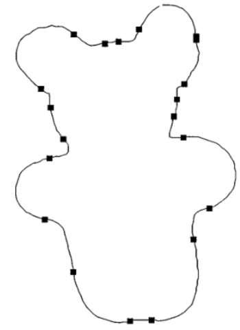

# Four Vertex Theorem

and its applications in object recognition.

---

# Volunteers?

We would like two volunteers to come up and we'll take a photo of
them.

The remaining presentation will show how the Four Vertex Theorem
helps us differentiate between an image of Gavin versus an image of
someone else purely based on boundaries.

---
layout: two-cols-header
layoutClass: gap-x-4
mdc: true
---

# Motivation

How do we compare objects?

::left::

{width=300px}

::right::

{width=300px}

::bottom::

Human intuition: vertex based. A monitor has 4 vertices, while
a mouse has no sharp corners.

---

# Challenge

<v-clicks>

Too many vertices!

Plus, a lot of them aren't actually meaningful. Even a tiny sharp
corner is counted as a vertex.

{width=200px}

Goal for simplification:
reduce the number of vertices while preserving the essential
shape.

</v-clicks>

---

# Key Question

What's the minimum structural complexity of a boundary?

Or: how many vertices can we throw away until we can't reliably
recognize anything?

---

# Four Vertex Theorem

The answer was revealed at the start...

<v-clicks>

## Terminology

- **Boundary:** a simple, closed, smooth plane curve $\alpha(t)$.

- **Vertex:** A certain $t$ where the curvature at this $t$ is a local
  extrema.

## Statement

A simple, closed, smooth plane curve has at least four local extrema:

- At least two local maxima.
- At least two local minima.

(assumes non-constant curvature, i.e. no circles)

</v-clicks>

---

## Intuition on the 4

